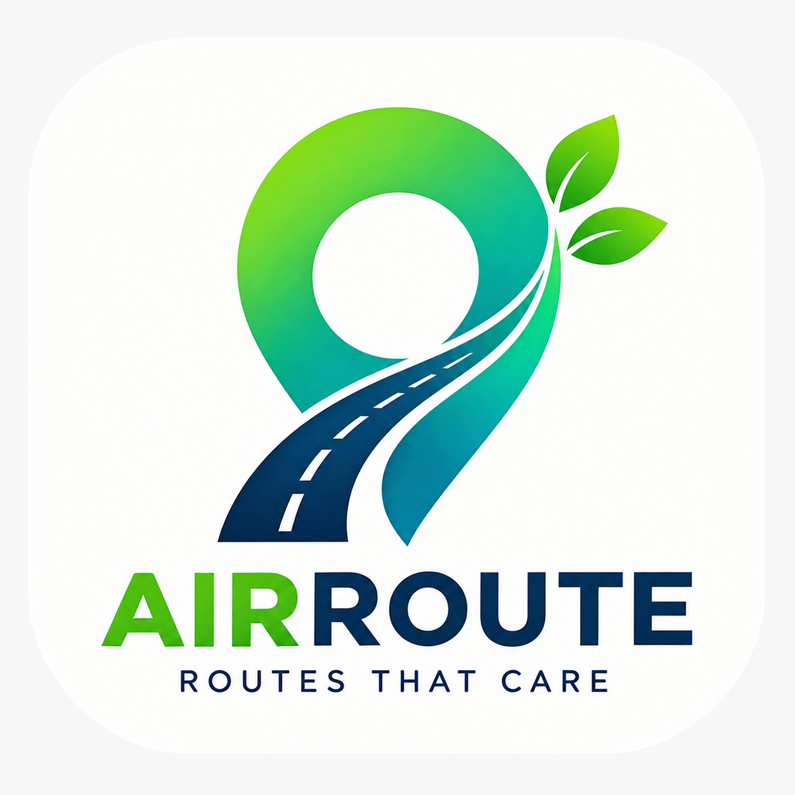

\<div align="center">

\

# AIRROUTE

### Routes That Care

**Pollution-Aware Route Recommendation System**

### Developed for **Udrah Industry**

\</div>

---

# 🌍 About AirRoute

**AirRoute** is a pollution-aware route recommendation application being developed for **Udrah Industry**.

The purpose of AirRoute is to help users choose routes that provide **lower estimated pollution exposure without unnecessarily increasing travel time**.

Unlike conventional navigation systems that primarily focus on the fastest or shortest route, AirRoute considers:

- 🗺️ Road route
- ⏱️ Travel time
- 📏 Distance
- 🌫️ Air Quality Index (AQI)
- 🧠 Estimated pollution exposure
- 🔄 Acceptable travel-time detour

The core objective is:

> **Minimize estimated pollution exposure subject to an acceptable travel-time detour constraint.**

---

# 🏢 Developed for Udrah Industry

AirRoute is being developed as a project for **Udrah Industry**, with the goal of building a practical technology solution around pollution-aware navigation.

```text
Udrah Industry
      │
      ▼
   AirRoute
      │
      ├── Smart Routing
      ├── Air Quality
      ├── Exposure Estimation
      └── Route Optimization
```

AirRoute is designed as an MVP that can later be extended with advanced data processing, machine learning, traffic intelligence, weather information, and predictive pollution modelling.

---

# 🚨 Problem Statement

Traditional navigation applications generally optimize routes around:

```text
Shortest Distance
        OR
Fastest Travel Time
```

However, the fastest route is not necessarily the route with the lowest pollution exposure.

For example:

| Route   | Travel Time | Pollution Exposure |
| ------- | ----------: | -----------------: |
| Route A |      30 min |               High |
| Route B |      34 min |                Low |
| Route C |      45 min |           Very Low |

If the user allows a maximum detour of **20%**, Route C may be rejected while Route B can be recommended.

AirRoute therefore asks:

> **"Can we choose a route with lower estimated pollution exposure while keeping the additional travel time acceptable?"**

---

# 💡 AirRoute Solution

AirRoute generates and evaluates candidate routes.

```text
Origin
  +
Destination
      ↓
Candidate Routes
      ↓
Travel Time
      +
Distance
      +
AQI Along Route
      ↓
Exposure Calculation
      ↓
Detour Constraint
      ↓
Best Acceptable Route
```

The application does **not** automatically choose the fastest route.

Instead:

```text
Fastest Route
      ↓
Baseline
      ↓
Filter routes by acceptable detour
      ↓
Compare pollution exposure
      ↓
Choose lowest-exposure route
```

---

# 🎯 Core Optimization Model

Let:

- `R` = candidate routes
- `T(r)` = travel time of route `r`
- `E(r)` = estimated pollution exposure of route `r`
- `T_fastest` = travel time of the fastest route
- `D_max` = maximum acceptable detour

A route is considered acceptable when:

```text
T(r) ≤ T_fastest × (1 + D_max)
```

Among all acceptable routes, AirRoute selects:

```text
argmin E(r)
```

### In simple words

> **First make sure the route is not too slow. Then choose the route with the lowest estimated pollution exposure.**

---

# 🧠 Recommendation Logic

```text
                 Candidate Routes
                        │
                        ▼
                Find Fastest Route
                        │
                        ▼
              Calculate AQI Exposure
                        │
                        ▼
              Apply Detour Constraint
                        │
              ┌─────────┴─────────┐
              ▼                   ▼
       Acceptable Routes     No Acceptable Route
              │                   │
              ▼                   ▼
       Lowest Exposure        Fallback Route
              │
              ▼
      Faster Route as
        Tie-Breaker
```

### Priority

1. Stay within the acceptable travel-time detour.
2. Minimize estimated pollution exposure.
3. Use faster/shorter route as a tie-breaker.
4. Use a controlled fallback when no route satisfies the constraint.

---

# ✨ Key Features

## 🗺️ Smart Route Planning

- Origin selection
- Destination selection
- Candidate route generation
- Route geometry
- Distance calculation
- Travel-time estimation
- Alternative route comparison

## 🌫️ Pollution Awareness

- AQI data retrieval
- AQI sampling along routes
- Route-level exposure estimation
- Primary AQI provider
- AQI fallback provider

## 🧠 Intelligent Recommendation

- Pollution-aware route selection
- Configurable maximum detour
- Lowest-exposure acceptable route
- Faster route tie-breaking
- Fallback route handling

## 📊 Route Comparison

Users can compare:

- Travel time
- Distance
- AQI
- Estimated exposure
- Detour percentage
- Route recommendation status

---

# 🏗️ System Architecture

```text
                         ┌───────────────────┐
                         │       USER        │
                         │   AIRROUTE APP    │
                         └─────────┬─────────┘
                                   │
                                   ▼
                         ┌───────────────────┐
                         │    Route API      │
                         │                   │
                         │ Validation        │
                         │ Route Processing  │
                         └─────────┬─────────┘
                                   │
                  ┌────────────────┼────────────────┐
                  │                │                │
                  ▼                ▼                ▼
            ┌──────────┐     ┌──────────┐     ┌──────────┐
            │   OSRM   │     │  OpenAQ  │     │   WAQI   │
            │ Routing  │     │ Primary  │     │ Fallback │
            └────┬─────┘     └────┬─────┘     └────┬─────┘
                 │                │                │
                 └────────────────┼────────────────┘
                                  ▼
                        ┌────────────────────┐
                        │  Exposure Engine   │
                        └─────────┬──────────┘
                                  │
                                  ▼
                        ┌────────────────────┐
                        │ Recommendation     │
                        │ Engine             │
                        └─────────┬──────────┘
                                  │
                                  ▼
                        ┌────────────────────┐
                        │ MapLibre Frontend  │
                        └────────────────────┘
```

---

# 🛠️ Technology Stack

| Layer        | Technology      |
| ------------ | --------------- |
| Application  | AirRoute        |
| Organization | Udrah Industry  |
| Frontend     | React / Next.js |
| Language     | TypeScript      |
| Styling      | Tailwind CSS    |
| Map          | MapLibre GL     |
| Routing      | OSRM            |
| Primary AQI  | OpenAQ          |
| Fallback AQI | WAQI            |
| Runtime      | Node.js         |

---

# 🛣️ Routing Provider — OSRM

AirRoute uses **OSRM (Open Source Routing Machine)** for road routing.

OSRM provides:

- Road-network routing
- Route geometry
- Distance
- Estimated duration
- Candidate route information

The responsibility is separated as follows:

```text
OSRM
  ↓
"What routes are possible?"

AirRoute Recommendation Engine
  ↓
"Which acceptable route has lower exposure?"
```

---

# 🌫️ AQI Provider Architecture

AirRoute uses **OpenAQ as the primary AQI provider** and **WAQI as the fallback provider**.

```text
                    AQI Request
                         │
                         ▼
                       OpenAQ
                      PRIMARY
                         │
                 ┌───────┴───────┐
                 ▼               ▼
              Success          Failure
                 │               │
                 ▼               ▼
             Use Data           WAQI
                              FALLBACK
                                 │
                          ┌──────┴──────┐
                          ▼             ▼
                       Success        Failure
                          │             │
                          ▼             ▼
                       Use Data      Controlled
                                     Fallback
```

### Provider priority

```text
1. OpenAQ
2. WAQI
3. Application-level fallback handling
```

> Open-Meteo is not the primary AQI provider for the AirRoute MVP.

---

# 📐 AQI-Time Exposure Index

The current MVP uses an **AQI-Time Exposure Index**.

Conceptually:

```text
Exposure = Σ(AQIᵢ × Δtᵢ)
```

Where:

- `AQIᵢ` = AQI associated with route segment/sample `i`
- `Δtᵢ` = estimated time spent in that segment
- `Σ` = sum across the route

### Example

```text
Segment 1
AQI = 80
Time = 5 min

Segment 2
AQI = 150
Time = 10 min

Segment 3
AQI = 60
Time = 5 min
```

Therefore:

```text
Exposure
= (80 × 5)
+ (150 × 10)
+ (60 × 5)

= 2200 AQI-minutes
```

A lower exposure value is preferred.

> This is an estimated application-level index and is not a medical measurement of actual pollutant dose.

---

# 🔄 Complete Application Flow

```text
┌─────────────────────────────┐
│ User Opens AirRoute         │
└──────────────┬──────────────┘
               ▼
┌─────────────────────────────┐
│ Select Origin               │
└──────────────┬──────────────┘
               ▼
┌─────────────────────────────┐
│ Select Destination           │
└──────────────┬──────────────┘
               ▼
┌─────────────────────────────┐
│ Maximum Detour              │
└──────────────┬──────────────┘
               ▼
┌─────────────────────────────┐
│ Request Candidate Routes    │
└──────────────┬──────────────┘
               ▼
┌─────────────────────────────┐
│ OSRM Routing                │
└──────────────┬──────────────┘
               ▼
┌─────────────────────────────┐
│ Sample Route Coordinates    │
└──────────────┬──────────────┘
               ▼
┌─────────────────────────────┐
│ OpenAQ AQI                  │
└──────────────┬──────────────┘
               │
        OpenAQ unavailable?
               │
               ▼
┌─────────────────────────────┐
│ WAQI Fallback               │
└──────────────┬──────────────┘
               ▼
┌─────────────────────────────┐
│ Calculate Exposure          │
└──────────────┬──────────────┘
               ▼
┌─────────────────────────────┐
│ Apply Detour Constraint     │
└──────────────┬──────────────┘
               ▼
┌─────────────────────────────┐
│ Select Recommended Route    │
└──────────────┬──────────────┘
               ▼
┌─────────────────────────────┐
│ Display on MapLibre Map     │
└─────────────────────────────┘
```

---

# 🗺️ Map Interface

MapLibre is used for interactive map visualization.

The interface can show:

```text
🌿 Recommended Route

Travel Time: 34 min
Detour: +13%
Estimated Exposure: 2,100

Reason:
Lower estimated pollution exposure
within the allowed travel-time detour.
```

Possible route states:

- 🌿 Recommended
- ⚡ Fastest
- 🔵 Alternative
- ⚠️ Higher Exposure
- 🚫 Outside Detour Limit

---

# 📁 Project Structure

```text
AirRoute/
│
├── src/
│   ├── app/
│   │
│   ├── components/
│   │   ├── map/
│   │   ├── route/
│   │   └── ui/
│   │
│   ├── services/
│   │   ├── routing/
│   │   ├── aqi/
│   │   └── exposure/
│   │
│   ├── lib/
│   ├── types/
│   └── utils/
│
├── public/
│
├── assets/
│   └── airroute-logo.jpeg
│
├── .env.example
├── .gitignore
├── package.json
├── tsconfig.json
└── README.md
```

---

# 🔐 Environment Variables

Create:

```text
.env.local
```

Example:

```env
OPENAQ_API_KEY=
WAQI_API_KEY=
OSRM_BASE_URL=
NEXT_PUBLIC_APP_URL=http://localhost:3000
```

Never commit secret values.

Recommended `.gitignore`:

```gitignore
.env
.env.local
.env.production
.env*.local
```

---

# 🚀 Installation

## 1. Clone the repository

```bash
git clone <YOUR_REPOSITORY_URL>
cd AirRoute
```

## 2. Install dependencies

```bash
npm install
```

Or:

```bash
pnpm install
```

## 3. Configure environment variables

Create `.env.local` and configure the required values.

## 4. Start development server

```bash
npm run dev
```

Application:

```text
http://localhost:3000
```

---

# ▶️ Available Commands

```bash
# Development
npm run dev

# Production build
npm run build

# Production server
npm start

# Lint
npm run lint
```

---

# 🔌 Route Recommendation API

Typical endpoint:

```http
POST /api/route/recommend
```

Example request:

```json
{
  "origin": {
    "lat": 26.9124,
    "lng": 75.7873
  },
  "destination": {
    "lat": 26.8467,
    "lng": 75.8056
  },
  "maxDetourPercent": 20
}
```

Backend processing:

```text
Validate Request
       ↓
Get Candidate Routes
       ↓
Find Fastest Route
       ↓
Sample Coordinates
       ↓
Get AQI
       ↓
Calculate Exposure
       ↓
Apply Detour Constraint
       ↓
Select Recommended Route
       ↓
Return Route Data
```

---

# 🧠 Recommendation Pseudocode

```text
routes = getCandidateRoutes(origin, destination)

fastestRoute = routeWithMinimumTravelTime(routes)

maxAllowedTime =
    fastestRoute.time * (1 + maxDetourPercent / 100)

for route in routes:
    route.exposure = calculateExposure(route)

acceptableRoutes =
    routes where route.time <= maxAllowedTime

if acceptableRoutes is not empty:

    recommendedRoute =
        acceptable route with minimum exposure

    if exposure is tied:
        choose faster route

else:

    recommendedRoute = fastestRoute
```

---

# 🛡️ Error Handling

### Routing API failure

```text
OSRM Failure
     ↓
Controlled Error Response
```

### OpenAQ failure

```text
OpenAQ Failure
     ↓
WAQI Fallback
```

### Both AQI providers fail

```text
OpenAQ ❌
WAQI   ❌
   ↓
Controlled Fallback Handling
```

The system must **never fabricate AQI values** and present them as real measurements.

---

# ⚡ Performance

The route recommendation process can require multiple external API requests.

Potential optimizations include:

- Intelligent route sampling
- Coordinate deduplication
- AQI caching
- Request batching where supported
- Request timeouts
- Parallel independent requests
- Limiting candidate routes
- Reusing nearby AQI observations

---

# 🧪 Testing

## Routing

Test:

- Valid coordinates
- Invalid coordinates
- No route available
- Routing API failure
- Multiple routes

## AQI

Test:

- OpenAQ success
- OpenAQ empty response
- OpenAQ failure
- WAQI fallback
- Both providers unavailable
- Missing AQI observations

## Exposure

Test:

- Single segment
- Multiple segments
- Different AQI values
- Different segment durations
- Missing AQI

## Recommendation

Test:

```text
Fastest = Lowest Exposure
Fastest ≠ Lowest Exposure
Low Exposure + Valid Detour
Low Exposure + Invalid Detour
No Route Within Detour
Equal Exposure
```

---

# 🔒 Security

Private API keys must never be exposed in frontend code.

### ❌ Incorrect

```typescript
const API_KEY = "secret-key";
```

### ✅ Correct

```typescript
process.env.OPENAQ_API_KEY
```

All sensitive credentials should remain server-side.

---

# 🚢 Production Deployment

Recommended production architecture:

```text
                         INTERNET
                            │
                            ▼
                       HTTPS / SSL
                            │
                            ▼
                          NGINX
                            │
                            ▼
                    AIRROUTE APPLICATION
                            │
              ┌─────────────┼─────────────┐
              ▼             ▼             ▼
            OSRM          OpenAQ         WAQI
```

Production considerations:

- HTTPS / SSL
- Environment-specific secrets
- API rate limits
- Request validation
- API timeouts
- Logging
- Error monitoring
- Caching
- Compression
- Reverse proxy
- Health checks
- Provider fallback

---

# 🤖 Future ML Architecture

After the MVP is stable, AirRoute can introduce machine learning for pollution prediction.

```text
Historical AQI
       +
Traffic Data
       +
Weather
       +
Time of Day
       +
Road Characteristics
       ↓
Machine Learning Model
       ↓
Predicted Local Pollution
       ↓
Route Exposure
       ↓
Route Recommendation
```

Potential future capabilities:

- Pollution prediction
- Traffic-aware exposure
- Weather-aware exposure
- Historical AQI patterns
- Time-of-day pollution prediction
- Personalized route recommendations

---

# 🚀 Future Improvements

### Phase 2

- Historical AQI
- Better AQI interpolation
- Traffic integration
- Weather integration
- Vehicle type
- Walking routes
- Cycling routes
- Time-of-day effects

### Phase 3

- ML pollution prediction
- Predictive route exposure
- Personalized recommendations
- Large-scale route analytics
- Advanced environmental intelligence

---

# ⚠️ Limitations

AirRoute's exposure score is an **estimated index**, not a medical measurement.

Limitations include:

- AQI stations may be geographically sparse.
- AQI can change quickly.
- AQI may not be directly available on every road.
- Traffic conditions can change after route calculation.
- Actual exposure depends on vehicle conditions and ventilation.
- Individual exposure varies by travel mode and behavior.
- External API availability can affect recommendations.

AirRoute should therefore be treated as a **pollution-aware navigation aid**, not a medical or environmental guarantee.

---

# 🔀 Git Workflow

Recommended branch structure:

```text
main
│
├── development
│
├── feature/*
├── fix/*
└── day/*
```

Example:

```bash
git checkout main
git pull origin main

git checkout -b feature/route-recommendation
```

Commit:

```bash
git add .
git commit -m "feat: implement pollution-aware route recommendation"
```

Push:

```bash
git push origin feature/route-recommendation
```

Then create a Pull Request for review.

---

# 🤝 Contributing

1. Create a feature branch.
2. Implement the change.
3. Run linting.
4. Run tests.
5. Run the production build.
6. Commit the changes.
7. Push the branch.
8. Open a Pull Request.
9. Review and merge.

Before submitting:

```bash
npm run lint
npm run build
```

---

# 📌 Project Status

AirRoute is currently being developed as a **production-oriented MVP for Udrah Industry**.

### Current Core Architecture

```text
             AIRROUTE
                │
        ┌───────┼────────┐
        ▼       ▼        ▼
     MapLibre  OSRM    AQI
                       │
                 ┌─────┴─────┐
                 ▼           ▼
               OpenAQ       WAQI
              PRIMARY     FALLBACK
                 │
                 ▼
        AQI-Time Exposure
                 │
                 ▼
       Detour Constraint
                 │
                 ▼
      Route Recommendation
```

### Canonical MVP Decision

> **Minimize estimated pollution exposure subject to an acceptable travel-time detour constraint.**

The fastest route is the baseline and can be used as a tie-breaker or fallback, but it is **not the primary optimization objective**.

---

# 🏢 Udrah Industry × AirRoute

AirRoute represents a technology initiative being developed for **Udrah Industry**, combining:

```text
Software Engineering
        +
Maps & Routing
        +
Environmental Data
        +
Optimization
        +
Future AI/ML
```

The long-term vision is to build a navigation experience that considers not only **where people can go**, but also **the environmental conditions along the way**.

---

# 🌱 Product Vision

Traditional navigation asks:

> **"How fast can I get there?"**

AirRoute asks:

> **"How can I get there with lower estimated pollution exposure while keeping the journey reasonably fast?"**

\<div align="center">

### 🌿 AIRROUTE

**ROUTES THAT CARE**

**Developed for Udrah Industry**

\</div>
